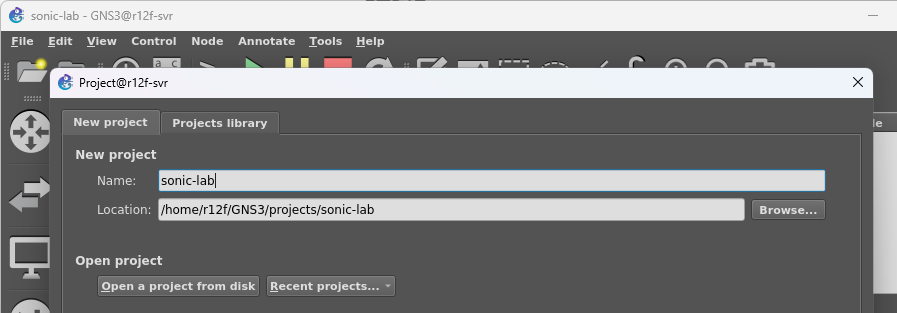
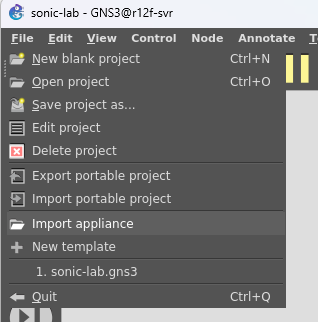
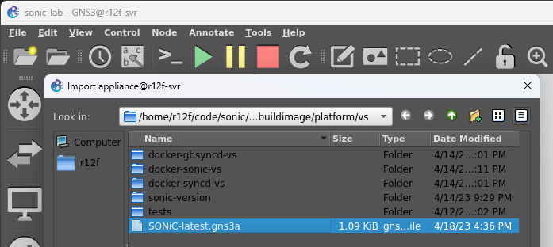
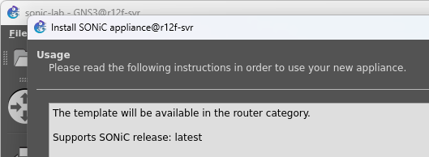
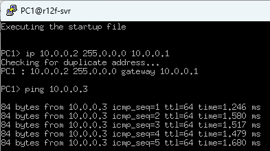
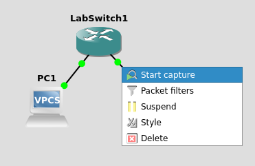
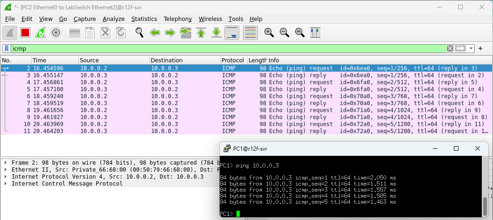

# 虚拟测试环境

虽然SONiC功能强大，但是大部分时候一台能够支持SONiC系统的交换机价格并不便宜，如果你只是想试一试SONiC，但是又不想花钱买一台SONiC的硬件设备，那么这一章一定不能错过，这一章会总结一下如何通过GNS3在本地搭建一个虚拟的SONiC的Lab，让你可以很快的在本地体验一把SONiC的基本功能。

在本地运行SONiC的方法很好几种，比如docker + vswitch，p4软交换机等等，对于初次使用而言，用GNS3可能是最方便快捷的了，所以本文就以GNS3为例，介绍一下如何在本地搭建一个SONiC的Lab。那么，我们就开始吧！

## 安装GNS3

首先，为了让我们方便而且直观的建立测试用的虚拟网络，我们需要先来安装一下GNS3。

[GNS3，全称为Graphical Network Simulator 3，是一个图形化的网络仿真软件][GNS3]。它支持多种不同的虚拟化技术，比如：QEMU、VMware、VirtualBox等等。这样，我们在等会搭建虚拟网络的时候，就不需要手动的运行很多命令，或者写脚本了，大部分的工作都可以通过图形界面来完成了。

### 安装依赖

安装它之前，我们需要先安装几个其他的软件：docker, wireshark, putty, qemu, ubridge, libvirt和bridge-utils，已经装好的小伙伴可以自行跳过。

首先是Docker，它们的安装过程，大家可以自己通过下面的传送门去安装：[https://docs.docker.com/engine/install/](https://docs.docker.com/engine/install/)

其他的在ubuntu上安装都非常简单，只需要执行下面的命令就可以了。这里安装时要注意，ubridge和Wireshark的安装过程中会询问是不是要创建wireshark用户组来bypass sudo，这里一定要选择Yes。

```
sudo apt-get install qemu-kvm libvirt-daemon-system libvirt-clients bridge-utils wireshark putty ubridge
```

安装好了之后，我们就可以来安装GNS3了。

### 安装GNS3

在Ubuntu上，GNS3的安装非常简单，只需要执行下面的命令就可以了。

```bash
sudo add-apt-repository ppa:gns3/ppa
sudo apt update                                
sudo apt install gns3-gui gns3-server
```

然后把你的用户加入到如下的组中，这样GNS3就可以去访问docker，wireshark等功能而不用sudo了。

```bash
for g in ubridge libvirt kvm wireshark docker; do
    sudo usermod -aG $g <user-name>
done
```

如果你使用的不是Ubuntu，更详细的安装文档可以参考[他们的官方文档][GNS3Install]。

## 准备SONiC的镜像

在测试之前，我们还需要一个SONiC的镜像。由于需要支持大量不同的厂商，而每个厂商的底层实现都不一样，所以最后每个厂商都会编译一个自己的镜像。这里因为我们在创建虚拟的环境，所以我们需要使用基于VSwitch的镜像来创建虚拟交换机：sonic-vs.img.gz。

[SONiC镜像的项目在这里](https://github.com/sonic-net/sonic-buildimage)，虽然我们可以自己去编译，但是速度实在有点慢，所以为了节省时间，我们可以直接[去这里下载最新的镜像](https://sonic-build.azurewebsites.net/ui/sonic/pipelines/142/builds?branchName=master)。只要找一个最新的成功的Build就行，在Artifacts中找到sonic-vs.img.gz，下载就可以了。

然后，我们来准备一下项目：

```bash
git clone --recurse-submodules https://github.com/sonic-net/sonic-buildimage.git
cd sonic-buildimage/platform/vs

# 将下载的镜像放在这个目录下，然后运行下面这个命令进行解压缩。
gzip -d sonic-vs.img.gz

# 下面这个命令会生成GNS3的镜像配置文件
./sonic-gns3a.sh
```

执行完成之后，我们运行`ls`命令就可以看到我们需要的镜像文件了。

```bash
r12f@r12f-svr:~/code/sonic/sonic-buildimage/platform/vs
$ l
total 2.8G
...
-rw-rw-r--  1 r12f r12f 1.1K Apr 18 16:36 SONiC-latest.gns3a  # <= 这个是GNS3的镜像配置文件
-rw-rw-r--  1 r12f r12f 2.8G Apr 18 16:32 sonic-vs.img        # <= 这个是我们解压出来的镜像
...
```

## 导入镜像

现在，在命令行里面输入`gns3`，就可以启动GNS3了。如果你是ssh到另外一台机器上，可以试着启用X11转发，这样就可以在远程运行GNS3，但是图形界面显示在本地了。我就是这样，将GNS3运行在了远程的服务器上，但是图形界面通过MobaXterm显示在了本地的Windows机器上。

运行起来之后，GNS3会让我们创建一个项目，很简单，填个目录地址就好。如果你是使用的X11转发，请注意，这个目录是在你远程服务器上，而不是本地。



然后，我们就可以通过`File -> Import appliance`来导入我们刚刚生成的镜像了。



选择我们刚刚生成的`SONiC-latest.gns3a`镜像配置文件，然后点击`Next`。



这个时候就可以看到我们的ji镜像了，点击`Next`。


这个时候会开始导入镜像，这个过程可能会比较慢，因为GNS3需要将镜像转换成qcow2格式，放入我们的项目目录中。导入完成之后，我们就可以看到我们的镜像了。



好的！完成！

## 创建网络

好了！现在一切就绪，我们还是创建一个虚拟的网络吧！

GNS3的图形界面非常的好用，基本上就是打开侧边栏，把交换机拖进来，把VPC拖进来，然后把线连起来就可以了。连接好之后记得点上面的Play按钮开始网络模拟。这里我们就不多说了，直接上图。


接着，在交换机上点击右键，选择`Custom Console`，再选择Putty，就可以打开我们的上面看到的交换机的Console了。这里，SONiC的默认用户名和密码是`admin`和`YourPaSsWoRd`。登录进去之后，我们就可以运行熟悉的命令，用`show interfaces status`或者`show ip interface`来查看网络的状态了。我们这里也可以看到，前面两个我们连接好了的Interface的状态都是`up`的了。

除了这种简单的网络以外，GNS3还可以创建非常复杂的网络，比如多层ECMP结构等等。这里就不多说了，有兴趣的可以自己去试一试~

## 配置网络

SONiC软交换机下，默认的端口使用的是10.0.0.x的子网（如下），而且都是eth pair：

```bash
admin@sonic:~$ show ip interfaces
Interface    Master    IPv4 address/mask    Admin/Oper    BGP Neighbor    Neighbor IP
-----------  --------  -------------------  ------------  --------------  -------------
Ethernet0              10.0.0.0/31          up/up         ARISTA01T2      10.0.0.1
Ethernet4              10.0.0.2/31          up/up         ARISTA02T2      10.0.0.3
Ethernet8              10.0.0.4/31          up/up         ARISTA03T2      10.0.0.5
```

这里，我们比较方便的做法是创建一个小的vlan，把我们的端口都包在里面（我们这里用的是Ethernet4和Ethernet8）：

```bash
# Remove old config
sudo config interface ip remove Ethernet4 10.0.0.2/31
sudo config interface ip remove Ethernet8 10.0.0.4/31

# Create VLAN with id 2
sudo config vlan add 2

# Add ports to VLAN
sudo config vlan member add -u 2 Ethernet4
sudo config vlan member add -u 2 Ethernet8

# Add IP address to VLAN
sudo config interface ip add Vlan2 10.0.0.0/24
```

这样，我们的vlan就创建好了，我们可以通过`show vlan brief`来查看一下：

```bash
admin@sonic:~$ show vlan brief
+-----------+--------------+-----------+----------------+-------------+-----------------------+
|   VLAN ID | IP Address   | Ports     | Port Tagging   | Proxy ARP   | DHCP Helper Address   |
+===========+==============+===========+================+=============+=======================+
|         2 | 10.0.0.0/24  | Ethernet4 | untagged       | disabled    |                       |
|           |              | Ethernet8 | untagged       |             |                       |
+-----------+--------------+-----------+----------------+-------------+-----------------------+
```

然后，我们就可以给所有的主机配置一个10.0.0.x的IP地址了。

```bash
# VPC1
ip 10.0.0.2 255.0.0.0 10.0.0.1

# VPC2
ip 10.0.0.3 255.0.0.0 10.0.0.1
```

好的，现在我们来Ping一下吧！



通了！

## 抓包

上面，我们安装GNS3前，我们特意安装了Wireshark，这样我们就可以在GNS3里面抓包了。我们只需要右键点击图中我们想抓包的Link上，然后选择`Start capture`，就可以开始抓包了。



稍等一下，Wireshark就会自动打开，实时的显示所有的包，非常的方便：



## 更多的网络

除了上面这种最简单的网络搭建，我们其实可以用GNS3搭建很多非常复杂的网络来进行测试，比如多层ECMP + eBGP等等。XFlow Research发布了一篇非常详细的文档来介绍这些内容，感兴趣的小伙伴可以去传送到这篇文档去看看：[SONiC Deployment and Testing Using GNS3][SONiCWithGNS3]。

# 参考资料

1. [GNS3][GNS3]
2. [GNS3 Linux Install][GNS3Install]
3. [SONiC Deployment and Testing Using GNS3][SONiCWithGNS3]

[GNS3]: https://www.gns3.com/
[GNS3Install]: https://docs.gns3.com/docs/getting-started/installation/linux/
[SONiCWithGNS3]: https://xflowresearch.com/wp-content/uploads/2023/05/SONiC-Deployment-and-Testing-Using-GNS3.pdf