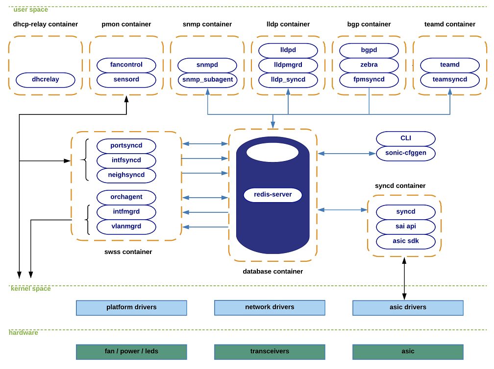

# SONiC入门指南

## 为什么要做SONiC

我们知道交换机内部都有一套可大可小的操作系统，用于配置和查看交换机的状态。但是，从1986年第一台交换机面世开始，虽然各个厂商都在进行着相关的开发，到现在为止种类也相当的多，但是依然存在一些问题，比如：

1. 生态封闭，不开源，主要是为了支持自家的硬件，无法很好的兼容其他厂商的设备
2. 支持的场景很有限，难以使用同一套系统去支撑大规模的数据中心中复杂多变的场景
3. 升级可能会导致网络中断，难以实现无缝升级，这对于云提供商来说有时候是致命的
4. 设备功能升级缓慢，难以很好的支持快速的产品迭代

所以，微软在2016年发起了开源项目SONiC，希望能够通过开源的方式，让SONiC能够成为一个通用的网络操作系统，从而解决上面的问题。而且，由于微软在Azure中大范围的使用SONiC，也保证了SONiC的实现确实能够承受大规模的生产环境的考验，这也是SONiC的一个优势。

## 主体架构

SONiC是微软开发的基于debian的开源的网络操作系统，它的设计核心思想有三个：

1. **硬件和软件解耦**：通过SAI（Switch Abstraction Interface）将硬件的操作抽象出来，从而使得SONiC能够支持多种硬件平台。这一层抽象层由SONiC定义，由各个厂商来实现。
2. **使用docker容器将软件微服务化**：SONiC上的主要功能都被拆分成了一个个的docker容器，和传统的网络操作系统不同，升级系统可以只对其中的某个容器进行升级，而不需要整体升级和重启，这样就可以很方便的进行升级和维护，支持快速的开发和迭代。
3. **使用redis作为中心数据库对服务进行解耦**：绝大部分服务的配置和状态最后都被存储到中心的redis数据库中，这样不仅使得所有的服务可以很轻松的进行协作（数据存储和pubsub），也可以让我们很方便的在上面开发工具，使用统一的方法对各个服务进行操作和查询，而不用担心状态丢失和协议兼容问题，最后还可以很方便的进行状态的备份和恢复。

这让SONiC拥有了非常开放的生态（[Community][SONiCLanding]，[Workgroups][SONiCWG]，[Devices][SONiCDevices]），总体而言，SONiC的架构如下图所示：

_(Source: [SONiC Wiki - Architecture][SONiCArch])_

当然，这样的设计也有一些缺点，比如：对磁盘的占用会变大，不过，现在一点点存储空间并不是什么很大的问题，而且这个问题也都可以通过一些方法来解决。

## 发展方向

虽然交换机已经发展很多很多年了，但是随着现在云的发展，对网络的要求也越来越高，不管是直观的需求，比如更大的带宽，更大的容量，还是最新的研究，比如，带内计算，端网融合等等，都对交换机的发展提出了更高的要求和挑战，也促使着各大厂商和研究机构不断的进行创新。SONiC也一样，随着时间的发展，需求一点没有减少。

关于SONiC的发展方向，我们可以在它的[Roadmap][SONiCPlanning]中看到。如果大家对最新的动态感兴趣，也可以关注它的Workshop，比如，最近的[OCP Global Summit 2022 - SONiC Workshop][SONiCWorkshop]。这里就不展开了。

## 感谢

感谢以下朋友的帮助和贡献，没有你们也就没有这本入门指南！

[@bingwang-ms](https://github.com/bingwang-ms)

# License

本书使用 [署名-非商业性使用-相同方式共享（CC BY-NC-SA）4.0 许可协议](https://creativecommons.org/licenses/by-nc-sa/4.0/)。

# 参考资料

1. [SONiC Wiki - Architecture][SONiCArch]
2. [SONiC Wiki - Roadmap Planning][SONiCPlanning]
3. [SONiC Landing Page][SONiCLanding]
4. [SONiC Workgroups][SONiCWG]
5. [SONiC Supported Devices and Platforms][SONiCDevices]
6. [SONiC User Manual][SONiCManual]
7. [OCP Global Summit 2022 - SONiC Workshop][SONiCWorkshop]

[SONiCArch]: https://github.com/sonic-net/SONiC/wiki/Architecture
[SONiCPlanning]: https://github.com/sonic-net/SONiC/wiki/Sonic-Roadmap-Planning
[SONiCLanding]: https://sonic-net.github.io/SONiC/index.html
[SONiCWG]: https://sonic-net.github.io/SONiC/workgroups.html
[SONiCDevices]: https://sonic-net.github.io/SONiC/Supported-Devices-and-Platforms.html
[SONiCManual]: https://github.com/sonic-net/SONiC/blob/master/doc/SONiC-User-Manual.md
[SONiCWorkshop]: https://www.youtube.com/playlist?list=PLAG-eekRQBSjwK0DpyHJs76gOz1619KqW