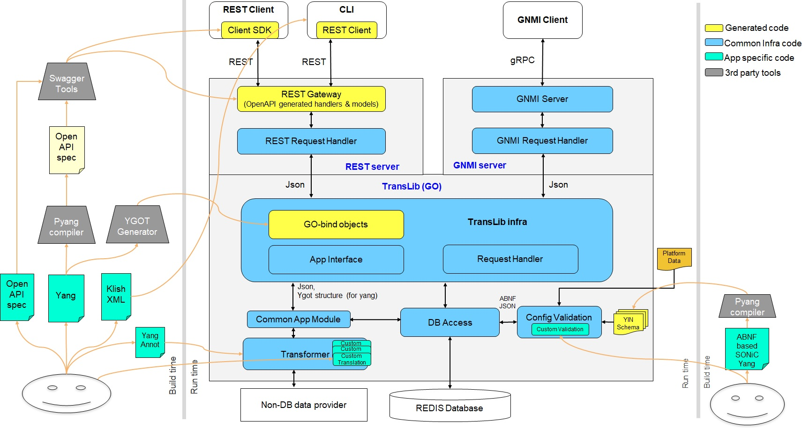

# 代码仓库

SONiC的代码都托管在[GitHub的sonic-net账号][SONiCGitHub]上，仓库数量有30几个之多，所以刚开始看SONiC的代码时，肯定是会有点懵的，不过不用担心，我们这里就来一起看看～

## 核心仓库

首先是SONiC中最重要的两个核心仓库：SONiC和sonic-buildimage。

### Landing仓库：SONiC

<https://github.com/sonic-net/SONiC>

这个仓库里面存储着SONiC的Landing Page和大量的文档，Wiki，教程，以往的Talk的Slides，等等等等。这个仓库可以说是每个新人上手最常用的仓库了，但是注意，这个仓库里面**没有任何的代码**，只有文档。

### 镜像构建仓库：sonic-buildimage

<https://github.com/sonic-net/sonic-buildimage>

这个构建仓库为什么对于我们十分重要？和其他项目不同，**SONiC的构建仓库其实才是它的主仓库**！这个仓库里面包含：

- 所有的功能实现仓库，它们都以submodule的形式被加入到了这个仓库中（`src`目录）
- 所有设备厂商的支持文件（`device`目录），比如每个型号的交换机的配置文件，用来访问硬件的支持脚本，等等等等，比如：我的交换机是Arista 7050 QX-32S，那么我就可以在`device/arista/x86_64-arista_7050_qx32s`目录中找到它的支持文件。
- 所有ASIC芯片厂商提供的支持文件（`platform`目录），比如每个平台的驱动程序，BSP，底层支持的脚本等等。这里我们可以看到几乎所有的主流芯片厂商的支持文件，比如：Broadcom，Mellanox，等等，也有用来做模拟软交换机的实现，比如vs和p4。
- SONiC用来构建所有容器镜像的Dockerfile（`dockers`目录）
- 各种各样通用的配置文件和脚本（`files`目录）
- 用来做构建的编译容器的dockerfile（`sonic-slave-*`目录）
- 等等……

正因为这个仓库里面将所有相关的资源全都放在了一起，所以我们学习SONiC的代码时，基本只需要下载这一个源码仓库就可以了，不管是搜索还是跳转都非常方便！

## 功能实现仓库

除了核心仓库，SONiC下还有很多功能实现仓库，里面都是各个容器和子服务的实现，这些仓库都被以submodule的形式放在了sonic-buildimage的`src`目录下，如果我们想对SONiC进行修改和贡献，我们也需要了解一下。

### SWSS（Switch State Service）相关仓库

在上一篇中我们介绍过，SWSS容器是SONiC的大脑，在SONiC下，它由两个repo组成：[sonic-swss-common](https://github.com/sonic-net/sonic-swss-common)和[sonic-swss](https://github.com/sonic-net/sonic-swss)。

#### SWSS公共库：sonic-swss-common

首先是公共库：sonic-swss-common（<https://github.com/sonic-net/sonic-swss-common>）。

这个仓库里面包含了所有`*mgrd`和`*syncd`服务所需要的公共功能，比如，logger，json，netlink的封装，Redis操作和基于Redis的各种服务间通讯机制的封装等等。虽然能看出来这个仓库一开始的目标是专门给swss服务使用的，但是也正因为功能多，很多其他的仓库都有它的引用，比如`swss-sairedis`和`swss-restapi`。

#### SWSS主仓库：sonic-swss

然后就是SWSS的主仓库sonic-swss了：<https://github.com/sonic-net/sonic-swss>。

我们可以在这个仓库中找到：

- 绝大部分的`*mgrd`和`*syncd`服务：`orchagent`, `portsyncd/portmgrd/intfmgrd`，`neighsyncd/nbrmgrd`，`natsyncd/natmgrd`，`buffermgrd`，`coppmgrd`，`macsecmgrd`，`sflowmgrd`，`tunnelmgrd`，`vlanmgrd`，`vrfmgrd`，`vxlanmgrd`，等等。
- `swssconfig`：在`swssconfig`目录下，用于在快速重启时（fast reboot）恢复FDB和ARP表。
- `swssplayer`：也在`swssconfig`目录下，用来记录所有通过SWSS进行的配置下发操作，这样我们就可以利用它来做replay，从而对问题进行重现和调试。
- 甚至一些不在SWSS容器中的服务，比如`fpmsyncd`（bgp容器）和`teamsyncd/teammgrd`（teamd容器）。

### SAI/平台相关仓库

接下来就是作为交换机抽象接口的SAI了，[虽然SAI是微软提出来并在2015年3月份发布了0.1版本](https://www.opencompute.org/documents/switch-abstraction-interface-ocp-specification-v0-2-pdf)，但是[在2015年9月份，SONiC都还没有发布第一个版本的时候，就已经被OCP接收并作为一个公共的标准了](https://azure.microsoft.com/en-us/blog/switch-abstraction-interface-sai-officially-accepted-by-the-open-compute-project-ocp/)，这也是SONiC能够在这么短的时间内就得到了这么多厂商的支持的原因之一。而也因为如此，SAI的代码仓库也被分成了两部分：

- OCP下的OpenComputeProject/SAI：<https://github.com/opencomputeproject/SAI>。里面包含了有关SAI标准的所有代码，包括SAI的头文件，behavior model，测试用例，文档等等。
- SONiC下的sonic-sairedis：<https://github.com/sonic-net/sonic-sairedis>。里面包含了SONiC中用来和SAI交互的所有代码，比如syncd服务，和各种调试统计，比如用来做replay的`saiplayer`和用来导出asic状态的`saidump`。

除了这两个仓库之外，还有一个平台相关的仓库，比如：[sonic-platform-vpp](https://github.com/sonic-net/sonic-platform-vpp)，它的作用是通过SAI的接口，利用vpp来实现数据平面的功能，相当于一个高性能的软交换机，个人感觉未来可能会被合并到buildimage仓库中，作为platform目录下的一部分。

### 管理服务（mgmt）相关仓库

然后是SONiC中所有和[管理服务][SONiCMgmtFramework]相关的仓库：

| 名称 | 说明 |
| --- | --- |
| [sonic-mgmt-common](https://github.com/sonic-net/sonic-mgmt-common) | 管理服务的基础库，里面包含着`translib`，yang model相关的代码 |
| [sonic-mgmt-framework](https://github.com/sonic-net/sonic-mgmt-framework) | 使用Go来实现的REST Server，是下方架构图中的REST Gateway（进程名：`rest_server`） |
| [sonic-gnmi](https://github.com/sonic-net/sonic-gnmi) | 和sonic-mgmt-framework类似，是下方架构图中，基于gRPC的gNMI（gRPC Network Management Interface）Server |
| [sonic-restapi](https://github.com/sonic-net/sonic-restapi) | 这是SONiC使用go来实现的另一个配置管理的REST Server，和mgmt-framework不同，这个server在收到消息后会直接对CONFIG_DB进行操作，而不是走translib（下图中没有，进程名：`go-server-server`） |
| [sonic-mgmt](https://github.com/sonic-net/sonic-mgmt) | 各种自动化脚本（`ansible`目录），测试（`tests`目录），用来搭建test bed和测试上报（`test_reporting`目录）之类的， |

这里还是附上SONiC管理服务的架构图，方便大家配合食用 [\[4\]][SONiCMgmtFramework]：

### 平台监控相关仓库：sonic-platform-common和sonic-platform-daemons

以下两个仓库都和平台监控和控制相关，比如LED，风扇，电源，温控等等：

| 名称 | 说明 |
| --- | --- |
| [sonic-platform-common](https://github.com/sonic-net/sonic-platform-common) | 这是给厂商们提供的基础包，用来定义访问风扇，LED，电源管理，温控等等模块的接口定义，这些接口都是用python来实现的 |
| [sonic-platform-daemons](https://github.com/sonic-net/sonic-platform-daemons) | 这里包含了SONiC中pmon容器中运行的各种监控服务：`chassisd`，`ledd`，`pcied`，`psud`，`syseepromd`，`thermalctld`，`xcvrd`，`ycabled`，它们都使用python实现，通过和中心数据库Redis进行连接，和加载并调用各个厂商提供的接口实现来对各个模块进行监控和控制 |

### 其他功能实现仓库

除了上面这些仓库以外，SONiC还有很多实现其方方面面功能的仓库，有些是一个或多个进程，有些是一些库，它们的作用如下表所示：

| 仓库 | 介绍 |
| --- | --- |
| [sonic-snmpagent](https://github.com/sonic-net/sonic-snmpagent) | [AgentX](https://www.ietf.org/rfc/rfc2741.txt) SNMP subagent的实现（`sonic_ax_impl`），用于连接Redis数据库，给snmpd提供所需要的各种信息，可以把它理解成snmpd的控制面，而snmpd是数据面，用于响应外部SNMP的请求 |
| [sonic-frr](https://github.com/sonic-net/sonic-frr) | FRRouting，各种路由协议的实现，所以这个仓库中我们可以找到如`bgpd`，`zebra`这类的路由相关的进程实现 |
| [sonic-linkmgrd](https://github.com/sonic-net/sonic-linkmgrd) | Dual ToR support，检查Link的状态，并且控制ToR的连接 |
| [sonic-dhcp-relay](https://github.com/sonic-net/sonic-dhcp-relay) | DHCP relay agent |
| [sonic-dhcpmon](https://github.com/sonic-net/sonic-dhcpmon) | 监控DHCP的状态，并报告给中心数据库Redis |
| [sonic-dbsyncd](https://github.com/sonic-net/sonic-dbsyncd) | `lldp_syncd`服务，但是repo的名字没取好，叫做dbsyncd |
| [sonic-pins](https://github.com/sonic-net/sonic-pins) | Google开发的基于P4的网络栈支持（P4 Integrated Network Stack，PINS），更多信息可以参看[PINS的官网][SONiCPINS]。 |
| [sonic-stp](https://github.com/sonic-net/sonic-stp) | STP（Spanning Tree Protocol）的支持 |
| [sonic-ztp](https://github.com/sonic-net/sonic-ztp) | [Zero Touch Provisioning][SONiCZTP] |
| [DASH](https://github.com/sonic-net/DASH) | [Disaggregated API for SONiC Hosts][SONiCDASH] |
| [sonic-host-services](https://github.com/sonic-net/sonic-host-services) | 运行在host上通过dbus用来为容器中的服务提供支持的服务，比如保存和重新加载配置，保存dump之类的非常有限的功能，类似一个host broker |
| [sonic-fips](https://github.com/sonic-net/sonic-fips) | FIPS（Federal Information Processing Standards）的支持，里面有很多为了支持FIPS标准而加入的各种补丁文件 |
| [sonic-wpa-supplicant](https://github.com/sonic-net/sonic-wpa-supplicant) | 各种无线网络协议的支持 |

## 工具仓库：sonic-utilities

<https://github.com/sonic-net/sonic-utilities>

这个仓库存放着SONiC所有的命令行下的工具：

- `config`，`show`，`clear`目录：这是三个SONiC CLI的主命令的实现。需要注意的是，具体的命令实现并不一定在这几个目录里面，大量的命令是通过调用其他命令来实现的，这几个命令只是提供了一个入口。
- `scripts`，`sfputil`，`psuutil`，`pcieutil`，`fwutil`，`ssdutil`，`acl_loader`目录：这些目录下提供了大量的工具命令，但是它们大多并不是直接给用户使用的，而是被`config`，`show`和`clear`目录下的命令调用的，比如：`show platform fan`命令，就是通过调用`scripts`目录下的`fanshow`命令来实现的。
- `utilities_common`，`flow_counter_util`，`syslog_util`目录：这些目录和上面类似，但是提供的是基础类，可以直接在python中import调用。
- 另外还有很多其他的命令：`fdbutil`，`pddf_fanutil`，`pddf_ledutil`，`pddf_psuutil`，`pddf_thermalutil`，等等，用于查看和控制各个模块的状态。
- `connect`和`consutil`目录：这两个目录下的命令是用来连接到其他SONiC设备并对其进行管理的。
- `crm`目录：用来配置和查看SONiC中的[CRM（Critical Resource Monitoring）][SONiCCRM]。这个命令并没有被包含在`config`和`show`命令中，所以用户可以直接使用。
- `pfc`目录：用来配置和查看SONiC中的[PFC（Priority-based Flow Control）][SONiCPFC]。
- `pfcwd`目录：用来配置和查看SONiC中的[PFC Watch Dog][SONiCPFCWD]，比如启动，停止，修改polling interval之类的操作。

## 内核补丁：sonic-linux-kernel

<https://github.com/sonic-net/sonic-linux-kernel>

虽然SONiC是基于debian的，但是默认的debian内核却不一定能运行SONiC，比如某个模块默认没有启动，或者某些老版本的驱动有问题，所以SONiC需要或多或少有一些修改的Linux内核。而这个仓库就是用来存放所有的内核补丁的。

# 参考资料

1. [SONiC Architecture][SONiCArch]
2. [SONiC Source Repositories][SONiCRepo]
3. [SONiC Management Framework][SONiCMgmtFramework]
4. [SAI API][SAIAPI]
5. [SONiC Critical Resource Monitoring][SONiCCRM]
6. [SONiC Zero Touch Provisioning][SONiCZTP]
7. [SONiC Critical Resource Monitoring][SONiCCRM]
8. [SONiC P4 Integrated Network Stack][SONiCPINS]
9. [SONiC Disaggregated API for Switch Hosts][SONiCDash]
10. [SAI spec for OCP][SAISpec]

[SONiCIntro]: /posts/sonic-1-intro/
[SONiCArch]: https://github.com/sonic-net/SONiC/wiki/Architecture
[SONiCMgmtFramework]: https://github.com/sonic-net/SONiC/blob/master/doc/mgmt/Management%20Framework.md
[SAIAPI]: https://github.com/opencomputeproject/SAI/wiki/SAI-APIs
[SONiCRepo]: https://github.com/sonic-net/SONiC/blob/master/sourcecode.md
[SONiCSAIRedis]: https://github.com/sonic-net/sonic-sairedis/
[SONiCGitHub]: https://github.com/sonic-net
[SONiCCRM]: https://github.com/sonic-net/SONiC/wiki/Critical-Resource-Monitoring-High-Level-Design
[SONiCPINS]: https://opennetworking.org/pins/
[SONiCZTP]: https://github.com/sonic-net/SONiC/blob/master/doc/ztp/ztp.md
[SONiCDASH]: https://github.com/sonic-net/DASH/blob/main/documentation/general/dash-high-level-design.md
[SAISpec]: https://www.opencompute.org/documents/switch-abstraction-interface-ocp-specification-v0-2-pdf