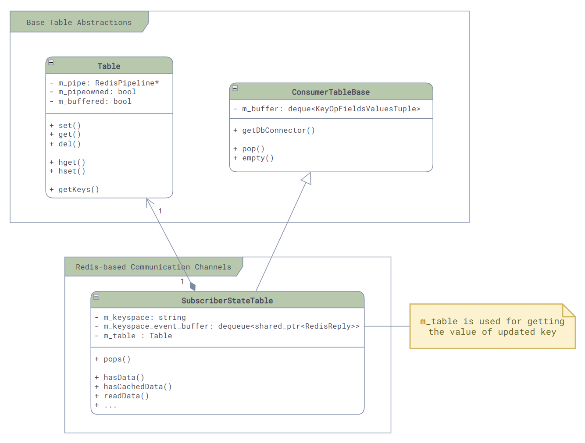
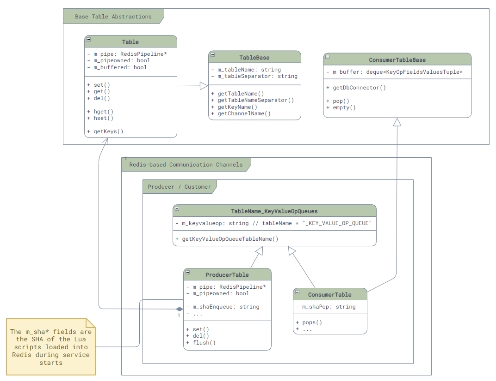
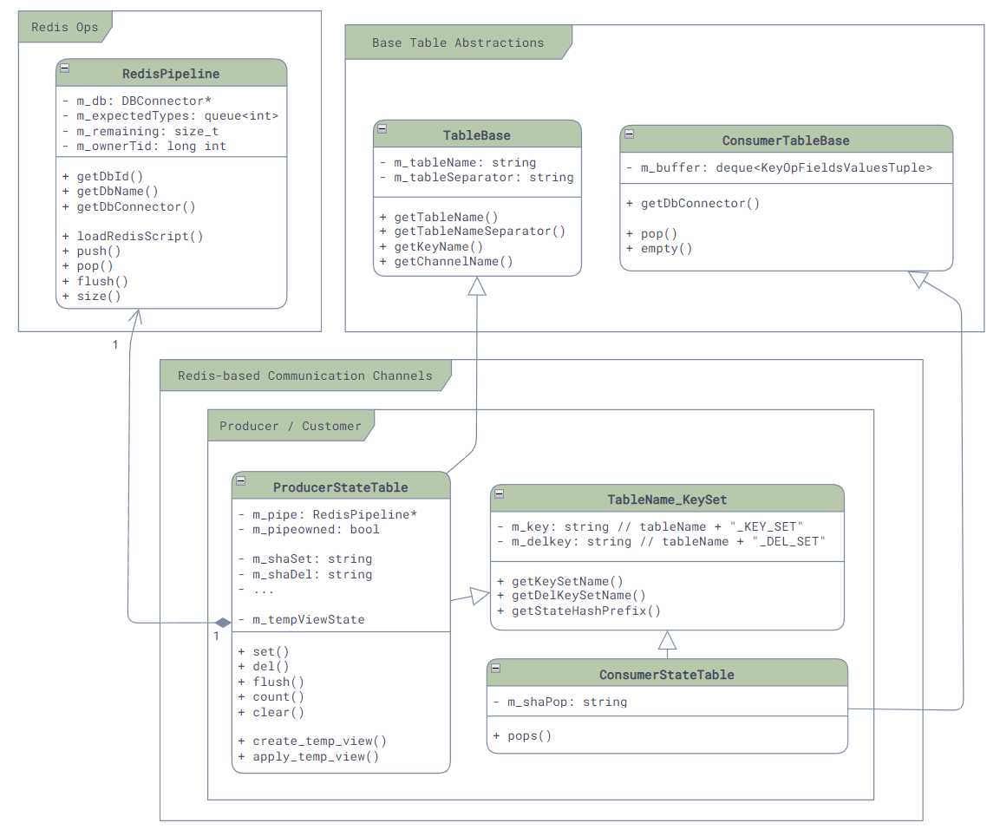

# 通信层 - PubSub

在Redis的封装和表抽象之上，便是SONiC的通信层了，由于需求的不同，这一层中提供了四种不同的PubSub的封装，用于服务间的通信。

## SubscribeStateTable

最直接的就是[SubscriberStateTable](https://github.com/sonic-net/sonic-swss-common/blob/master/common/subscriberstatetable.h)了。

它的原理是利用Redis数据库中自带的keyspace消息通知机制 [\[4\]][RedisKeyspace] —— 当数据库中的任何一个key对应的值发生了变化，就会触发Redis发送两个keyspace的事件通知，一个是`__keyspace@<db-id>__:<key>`下的`<op>`事件，一个是`__keyspace@<db-id>__:<op>`下的`<key>>`事件，比如，在数据库0中删除了一个key，那么就会触发两个事件通知：

```redis
PUBLISH __keyspace@0__:foo del
PUBLISH __keyevent@0__:del foo
```

而SubscriberStateTable就是监听了第一个事件通知，然后调用相应的回调函数。和其直接相关的主要的类的类图如下，这里可以看到它继承了ConsumerTableBase，因为它是Redis的消息的Consumer：



在初始化时，我们可以看到它是如何订阅Redis的事件通知的：

```cpp
// File: sonic-swss-common - common/subscriberstatetable.cpp
SubscriberStateTable::SubscriberStateTable(DBConnector *db, const string &tableName, int popBatchSize, int pri)
    : ConsumerTableBase(db, tableName, popBatchSize, pri), m_table(db, tableName)
{
    m_keyspace = "__keyspace@";
    m_keyspace += to_string(db->getDbId()) + "__:" + tableName + m_table.getTableNameSeparator() + "*";
    psubscribe(m_db, m_keyspace);
    // ...
```

其事件接收和分发主要由两个函数负责：

- `readData()`负责将redis中待读取的事件读取出来，并放入ConsumerTableBase中的队列中
- `pops()`：负责将队列中的原始事件取出来，并且进行解析，然后通过函数参数传递给调用方

```cpp
// File: sonic-swss-common - common/subscriberstatetable.cpp
uint64_t SubscriberStateTable::readData()
{
    // ...
    reply = nullptr;
    int status;
    do {
        status = redisGetReplyFromReader(m_subscribe->getContext(), reinterpret_cast<void**>(&reply));
        if(reply != nullptr && status == REDIS_OK) {
            m_keyspace_event_buffer.emplace_back(make_shared<RedisReply>(reply));
        }
    } while(reply != nullptr && status == REDIS_OK);
    // ...
    return 0;
}

void SubscriberStateTable::pops(deque<KeyOpFieldsValuesTuple> &vkco, const string& /*prefix*/)
{
    vkco.clear();
    // ...

    // Pop from m_keyspace_event_buffer, which is filled by readData()
    while (auto event = popEventBuffer()) {
        KeyOpFieldsValuesTuple kco;
        // Parsing here ...
        vkco.push_back(kco);
    }

    m_keyspace_event_buffer.clear();
}
```

## NotificationProducer / NotificationConsumer

说到消息通信，我们很容易就会联想到消息队列，这就是我们的第二种通信方式 —— [NotificationProducer](https://github.com/sonic-net/sonic-swss-common/blob/master/common/notificationproducer.h)和[NotificationConsumer](https://github.com/sonic-net/sonic-swss-common/blob/master/common/notificationconsumer.h)。

这种通信方式通过Redis的自带的PubSub来实现，主要是对`PUBLISH`和`SUBSCRIBE`命令的包装，很有限的应用在最简单的通知型的场景中，比如orchagent中的timeout check, restart check之类，非传递用户配置和数据的场景：


这种通信模式下，消息的发送方Producer，主要会做两件事情：一是将消息打包成JSON格式，二是调用Redis的`PUBLISH`命令将消息发送出去。而且由于`PUBLISH`命令只能携带一个消息，所以请求中的`op`和`data`字段会被放在`values`的最前面，然后再调用`buildJson`函数将其打包成一个JSON数组的格式：

```cpp
int64_t swss::NotificationProducer::send(const std::string &op, const std::string &data, std::vector<FieldValueTuple> &values)
{
    // Pack the op and data into values array, then pack everything into a JSON string as the message
    FieldValueTuple opdata(op, data);
    values.insert(values.begin(), opdata);
    std::string msg = JSon::buildJson(values);
    values.erase(values.begin());

    // Publish message to Redis channel
    RedisCommand command;
    command.format("PUBLISH %s %s", m_channel.c_str(), msg.c_str());
    // ...
    RedisReply reply = m_pipe->push(command);
    reply.checkReplyType(REDIS_REPLY_INTEGER);
    return reply.getReply<long long int>();
}
```

接收方则是利用`SUBSCRIBE`命令来接收所有的通知：

```cpp
void swss::NotificationConsumer::subscribe()
{
    // ...
    m_subscribe = new DBConnector(m_db->getDbId(),
                                    m_db->getContext()->unix_sock.path,
                                    NOTIFICATION_SUBSCRIBE_TIMEOUT);
    // ...

    // Subscribe to Redis channel
    std::string s = "SUBSCRIBE " + m_channel;
    RedisReply r(m_subscribe, s, REDIS_REPLY_ARRAY);
}
```

## ProducerTable / ConsumerTable

我们可以看到NotificationProducer/Consumer实现简单粗暴，但是由于API的限制 [\[8\]][RedisClientHandling]，它并不适合用来传递数据，所以，SONiC中提供了一种和它非常接近的另外一种基于消息队列的通信机制 —— [ProducerTable](https://github.com/sonic-net/sonic-swss-common/blob/master/common/producertable.h)和[ConsumerTable](https://github.com/sonic-net/sonic-swss-common/blob/master/common/consumertable.h)。

这种通信方式通过Redis的List来实现，和Notification不同的地方在于，发布给Channel中的消息非常的简单（单字符"G"），所有的数据都存储在List中，从而解决了Notification中消息大小限制的问题。在SONiC中，它主要用在FlexCounter，`syncd`服务和`ASIC_DB`中：

1. **消息格式**：每条消息都是一个（Key, FieldValuePairs, Op）的三元组，如果用JSON来表达这个消息，那么它的格式如下：（这里的Key是Table中数据的Key，被操作的数据是[Hash][RedisHash]，所以Field就是Hash中的Field，Value就是Hash中的Value了，也就是说一个消息可以对很多个Field进行操作）

   ```json
   [ "Key", "[\"Field1\", \"Value1\", \"Field2", \"Value2\", ...]", "Op" ]
   ```

2. **Enqueue**：ProducerTable通过Lua脚本将消息三元组原子的写入消息队列中（Key = `<table-name>_KEY_VALUE_OP_QUEUE`，并且发布更新通知到特定的Channel（Key = `<table-name>_CHANNEL`）中。
3. **Pop**：ConsumerTable也通过Lua脚本从消息队列中原子的读取消息三元组，并**在读取过程中**将其中请求的改动真正的写入到数据库中。

```admonish note
**注意**：Redis中Lua脚本和MULTI/EXEC的原子性和通常说的数据库ACID中的原子性（Atomicity）不同，Redis中的原子性其实更接近于ACID中的隔离性（Isolation），他保证Lua脚本中所有的命令在执行的时候不会有其他的命令执行，但是并不保证Lua脚本中的所有命令都会执行成功，比如，如果Lua脚本中的第二个命令执行失败了，那么第一个命令依然会被提交，只是后面的命令就不会继续执行了。更多的细节可以参考Redis官方文档 [\[5\]][RedisTx] [\[6\]][RedisLuaAtomicity]。
```

其主要类图如下，这里我们可以看到在ProducerTable中的`m_shaEnqueue`和ConsumerTable中的`m_shaPop`，它们就是上面我们提到的这两个Lua脚本在加载时获得的SHA了，而之后我们就可以使用Redis的`EVALSHA`命令对他们进行原子的调用了：



ProducerTable的核心逻辑如下，我们可以看到对Values的JSON打包，和使用`EVALSHA`来进行Lua脚本的调用：

```cpp
// File: sonic-swss-common - common/producertable.cpp
ProducerTable::ProducerTable(RedisPipeline *pipeline, const string &tableName, bool buffered)
    // ...
{
    string luaEnque =
        "redis.call('LPUSH', KEYS[1], ARGV[1], ARGV[2], ARGV[3]);"
        "redis.call('PUBLISH', KEYS[2], ARGV[4]);";

    m_shaEnque = m_pipe->loadRedisScript(luaEnque);
}

void ProducerTable::set(const string &key, const vector<FieldValueTuple> &values, const string &op, const string &prefix)
{
    enqueueDbChange(key, JSon::buildJson(values), "S" + op, prefix);
}

void ProducerTable::del(const string &key, const string &op, const string &prefix)
{
    enqueueDbChange(key, "{}", "D" + op, prefix);
}

void ProducerTable::enqueueDbChange(const string &key, const string &value, const string &op, const string& /* prefix */)
{
    RedisCommand command;

    command.format(
        "EVALSHA %s 2 %s %s %s %s %s %s",
        m_shaEnque.c_str(),
        getKeyValueOpQueueTableName().c_str(),
        getChannelName(m_pipe->getDbId()).c_str(),
        key.c_str(),
        value.c_str(),
        op.c_str(),
        "G");

    m_pipe->push(command, REDIS_REPLY_NIL);
}
```

而另一侧的ConsumerTable就稍稍复杂一点，因为其支持的op类型很多，所以逻辑都写在了一个单独的文件中（`common/consumer_table_pops.lua`），我们这里就不贴代码了，有兴趣的同学可以自己去看看。

```cpp
// File: sonic-swss-common - common/consumertable.cpp
ConsumerTable::ConsumerTable(DBConnector *db, const string &tableName, int popBatchSize, int pri)
    : ConsumerTableBase(db, tableName, popBatchSize, pri)
    , TableName_KeyValueOpQueues(tableName)
    , m_modifyRedis(true)
{
    std::string luaScript = loadLuaScript("consumer_table_pops.lua");
    m_shaPop = loadRedisScript(db, luaScript);
    // ...
}

void ConsumerTable::pops(deque<KeyOpFieldsValuesTuple> &vkco, const string &prefix)
{
    // Note that here we are processing the messages in bulk with POP_BATCH_SIZE!
    RedisCommand command;
    command.format(
        "EVALSHA %s 2 %s %s %d %d",
        m_shaPop.c_str(),
        getKeyValueOpQueueTableName().c_str(),
        (prefix+getTableName()).c_str(),
        POP_BATCH_SIZE,

    RedisReply r(m_db, command, REDIS_REPLY_ARRAY);
    vkco.clear();

    // Parse and pack the messages in bulk
    // ...
}
```

## ProducerStateTable / ConsumerStateTable

Producer/ConsumerTable虽然直观，而且保序，但是它一个消息只能处理一个Key，并且还需要JSON的序列化，然而很多时候我们并用不到保序的功能，反而更需要更大的吞吐量，所以为了优化性能，SONiC就引入了第四种通信方式，也是最常用的通信方式：[ProducerStateTable](https://github.com/sonic-net/sonic-swss-common/blob/master/common/producerstatetable.h)和[ConsumerStateTable](https://github.com/sonic-net/sonic-swss-common/blob/master/common/consumertatetable.h)。

与ProducerTable不同，ProducerStateTable使用Hash的方式来存储消息，而不是List。这样虽然不能保证消息的顺序，但是却可以很好的提升性能！首先，我们省下了JSON的序列化的开销，其次，对于同一个Key下的相同的Field如果被变更多次，那么只需要保留最后一次的变更，这样就将关于这个Key的所有变更消息就合并成了一条，减少了很多不必要的消息处理。

Producer/ConsumerStateTable的底层实现相比于Producer/ConsumerTable也更加复杂一些。其相关联的类的主要类图如下，这里我们依然可以看到它的实现是通过`EVALSHA`调用Lua脚本来实现的，`m_shaSet`和`m_shaDel`就是用来存放修改和发送消息的，而另一边`m_shaPop`就是用来获取消息的：



在传递消息时：

- 首先，每个消息会被存放成两个部分：一个是KEY_SET，用来保存当前有哪些Key发生了修改，它以Set的形式存放在`<table-name_KEY_SET>`的key下，另一个是所有被修改的Key的内容，它以Hash的形式存放在`_<redis-key-name>`的key下。
- 然后，消息存放之后Producer如果发现是新的Key，那么就是调用`PUBLISH`命令，来通知`<table-name>_CHANNEL@<db-id>`Channel，有新的Key出现了。

  ```cpp
  // File: sonic-swss-common - common/producerstatetable.cpp
  ProducerStateTable::ProducerStateTable(RedisPipeline *pipeline, const string &tableName, bool buffered)
      : TableBase(tableName, SonicDBConfig::getSeparator(pipeline->getDBConnector()))
      , TableName_KeySet(tableName)
      // ...
  {
      string luaSet =
          "local added = redis.call('SADD', KEYS[2], ARGV[2])\n"
          "for i = 0, #KEYS - 3 do\n"
          "    redis.call('HSET', KEYS[3 + i], ARGV[3 + i * 2], ARGV[4 + i * 2])\n"
          "end\n"
          " if added > 0 then \n"
          "    redis.call('PUBLISH', KEYS[1], ARGV[1])\n"
          "end\n";

      m_shaSet = m_pipe->loadRedisScript(luaSet);
  ```

- 最后，Consumer会通过`SUBSCRIBE`命令来订阅`<table-name>_CHANNEL@<db-id>`Channel，一旦有新的消息到来，就会使用Lua脚本调用`HGETALL`命令来获取所有的Key，并将其中的值读取出来并真正的写入到数据库中去。

  ```cpp
  ConsumerStateTable::ConsumerStateTable(DBConnector *db, const std::string &tableName, int popBatchSize, int pri)
      : ConsumerTableBase(db, tableName, popBatchSize, pri)
      , TableName_KeySet(tableName)
  {
      std::string luaScript = loadLuaScript("consumer_state_table_pops.lua");
      m_shaPop = loadRedisScript(db, luaScript);
      // ...
  
      subscribe(m_db, getChannelName(m_db->getDbId()));
      // ...
  ```

为了方便理解，我们这里举一个例子：启用Port Ethernet0：

- 首先，我们在命令行下调用`config interface startup Ethernet0`来启用Ethernet0，这会导致`portmgrd`通过ProducerStateTable向APP_DB发送状态更新消息，如下：

  ```redis
  EVALSHA "<hash-of-set-lua>" "6" "PORT_TABLE_CHANNEL@0" "PORT_TABLE_KEY_SET" 
      "_PORT_TABLE:Ethernet0" "_PORT_TABLE:Ethernet0" "_PORT_TABLE:Ethernet0" "_PORT_TABLE:Ethernet0" "G"
      "Ethernet0" "alias" "Ethernet5/1" "index" "5" "lanes" "9,10,11,12" "speed" "40000"
  ```

  这个命令会在其中调用如下的命令来创建和发布消息：

  ```redis
  SADD "PORT_TABLE_KEY_SET" "_PORT_TABLE:Ethernet0"
  HSET "_PORT_TABLE:Ethernet0" "alias" "Ethernet5/1"
  HSET "_PORT_TABLE:Ethernet0" "index" "5"
  HSET "_PORT_TABLE:Ethernet0" "lanes" "9,10,11,12"
  HSET "_PORT_TABLE:Ethernet0" "speed" "40000"
  PUBLISH "PORT_TABLE_CHANNEL@0" "_PORT_TABLE:Ethernet0"
  ```

  所以最终这个消息会在APPL_DB中被存放成如下的形式：

  ```redis
  PORT_TABLE_KEY_SET:
    _PORT_TABLE:Ethernet0

  _PORT_TABLE:Ethernet0:
    alias: Ethernet5/1
    index: 5
    lanes: 9,10,11,12
    speed: 40000
  ```

- 当ConsumerStateTable收到消息后，也会调用`EVALSHA`命令来执行Lua脚本，如下：

  ```redis
  EVALSHA "<hash-of-pop-lua>" "3" "PORT_TABLE_KEY_SET" "PORT_TABLE:" "PORT_TABLE_DEL_SET" "8192" "_"
  ```

  和Producer类似，这个脚本会执行如下命令，将`PORT_TABLE_KEY_SET`中的key，也就是`_PORT_TABLE:Ethernet0`读取出来，然后再将其对应的Hash读取出来，并更新到`PORT_TABLE:Ethernet0`去，同时将`_PORT_TABLE:Ethernet0`从数据库和`PORT_TABLE_KEY_SET`中删除。

  ```redis
  SPOP "PORT_TABLE_KEY_SET" "_PORT_TABLE:Ethernet0"
  HGETALL "_PORT_TABLE:Ethernet0"
  HSET "PORT_TABLE:Ethernet0" "alias" "Ethernet5/1"
  HSET "PORT_TABLE:Ethernet0" "index" "5"
  HSET "PORT_TABLE:Ethernet0" "lanes" "9,10,11,12"
  HSET "PORT_TABLE:Ethernet0" "speed" "40000"
  DEL "_PORT_TABLE:Ethernet0"
  ```

  到这里，数据的更新才算是完成了。

# 参考资料

1. [SONiC Architecture][SONiCArch]
2. [Github repo: sonic-swss][SONiCSWSS]
3. [Github repo: sonic-swss-common][SONiCSWSSCommon]
4. [Redis keyspace notifications][RedisKeyspace]
5. [Redis Transactions][RedisTx]
6. [Redis Atomicity with Lua][RedisLuaAtomicity]
7. [Redis hashes][RedisHash]
8. [Redis client handling][RedisClientHandling]

[SONiCArch]: https://github.com/sonic-net/SONiC/wiki/Architecture
[SONiCSWSS]: https://github.com/sonic-net/sonic-swss
[SONiCSWSSCommon]: https://github.com/sonic-net/sonic-swss-common
[RedisKeyspace]: https://redis.io/docs/manual/keyspace-notifications/
[RedisTx]: https://redis.io/docs/manual/transactions/
[RedisLuaAtomicity]: https://developer.redis.com/develop/java/spring/rate-limiting/fixed-window/reactive-lua/
[RedisHash]: https://redis.io/docs/data-types/hashes/
[RedisClientHandling]: https://redis.io/docs/reference/clients/